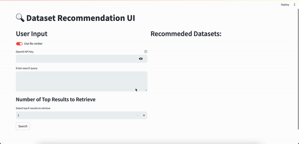

# IntelliMatch: Translating Research Intentions into Precision Dataset Recommendations with Contrastive Learning and LLM Re-Ranking



## Table of Contents

- [About](#about)
- [Getting Started](#getting_started)
- [Usage](#usage)

## About <a name = "about"></a>

This repository is an implementation of the user-interface from a paper []().

## Getting Started <a name = "getting_started"></a>

### Prerequisites

Before running the user-interface, please download the model weight from the google drive [weight.zip](https://drive.google.com/file/d/1HEwQHdDBiVuj1FuO3zHQ11lhj0W3vJZk/view?usp=drive_link).

### Installing

```
pip install -r requirements.txt
```

## Usage <a name = "usage"></a>

To run the ui, simply:

```
streamlit run ui.py
```
